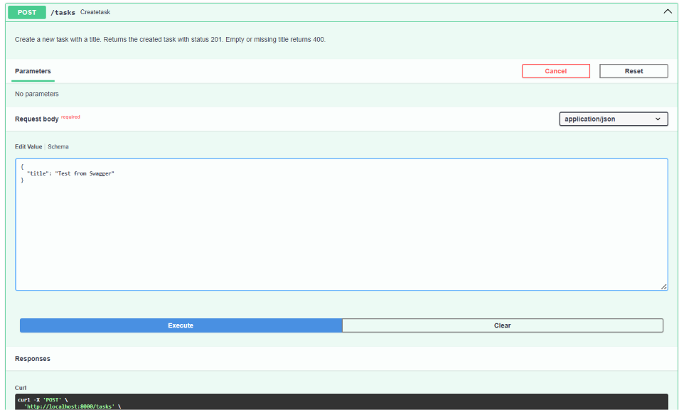
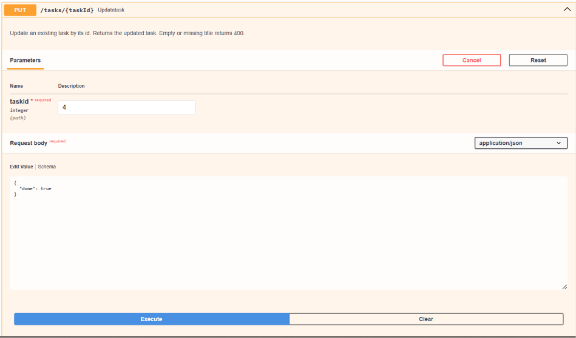
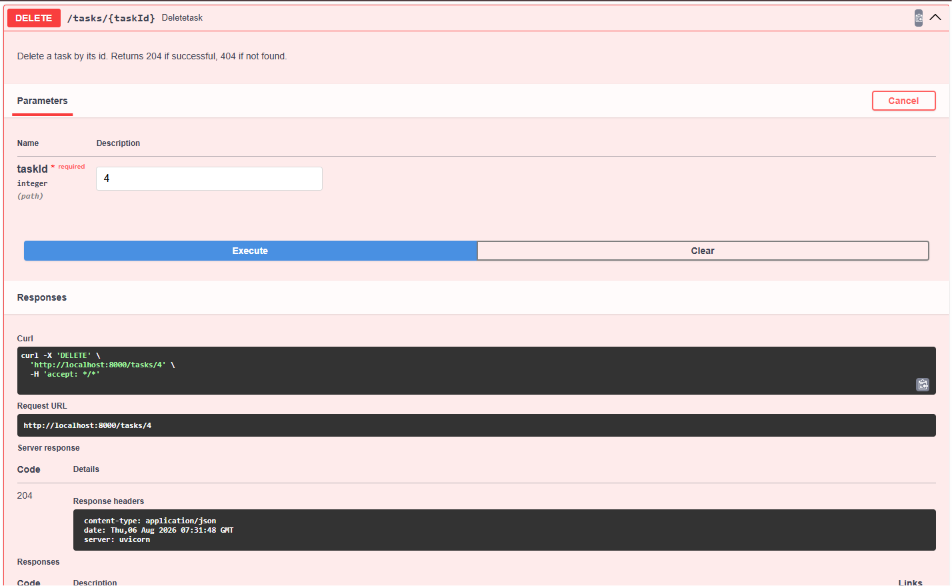

# Task API

A simple CRUD REST API for managing tasks, built with FastAPI.

## What this is

A backend API that lets you create, read, update, and delete tasks.
Each task has an id, a title, and a done status. Built as a learning
project to practice API fundamentals (routes, status codes,
validation) and interactive API docs (Swagger UI).

## How to run it

1. Install dependencies:
```bash
   pip install fastapi uvicorn
```

2. Run the server:
```bash
   uvicorn apiCRUD:myApp --reload
```

3. Open your browser to `http://localhost:8000/docs` to try it out interactively.

## Endpoints

| Method | Path            | Description                          |
|--------|-----------------|---------------------------------------|
| GET    | `/`             | Basic API info                        |
| GET    | `/health`       | Health check                          |
| GET    | `/tasks`        | List all tasks                        |
| POST   | `/tasks`        | Create a new task                     |
| GET    | `/tasks/{id}`   | Get a single task by id               |
| PUT    | `/tasks/{id}`   | Update a task's title and/or done     |
| DELETE | `/tasks/{id}`   | Delete a task by id                   |

## Example request

```bash
curl -i -X POST http://localhost:8000/tasks -H "Content-Type: application/json" -d '{"title":"Take a shower"}'
```
```
HTTP/1.1 201 Created
date: Thu, 06 Aug 2026 07:58:39 GMT
server: uvicorn
content-length: 45
content-type: application/json

{"id":5,"title":"Take a shower","done":false}
```
## SWAGGER UI

**All endpoints:**

**Create task:**


**Create task (response):**
.png)

**Confirm task created:**


**Update task:**


**Update task (response):**
.png)

**Delete task:**


**List after delete:**


